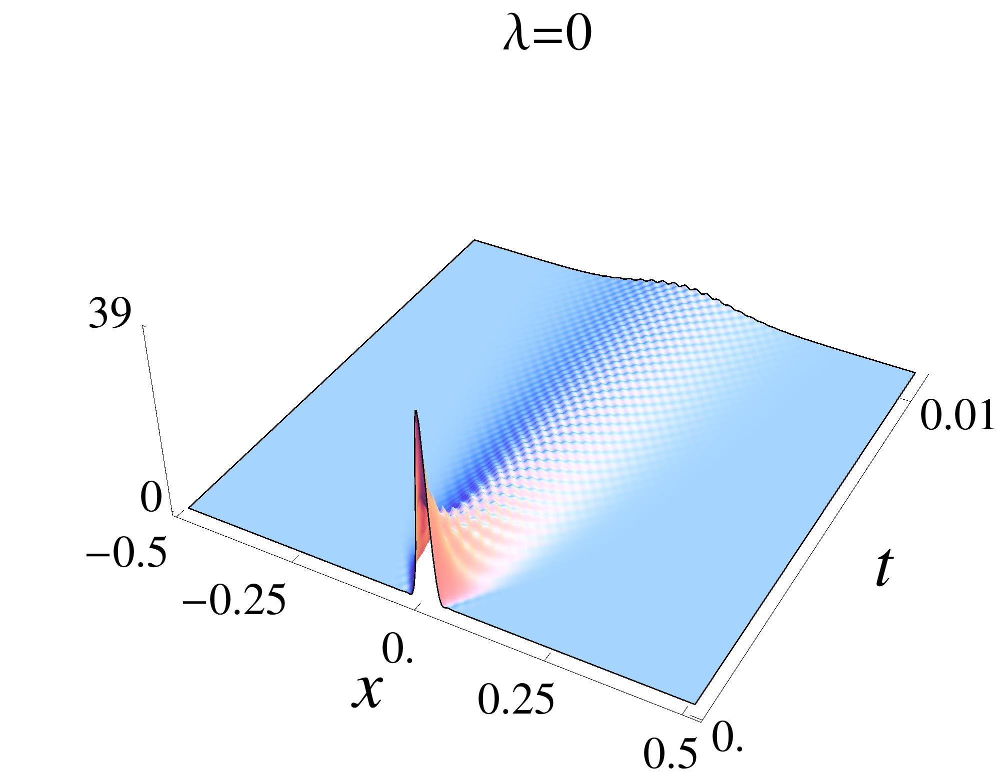
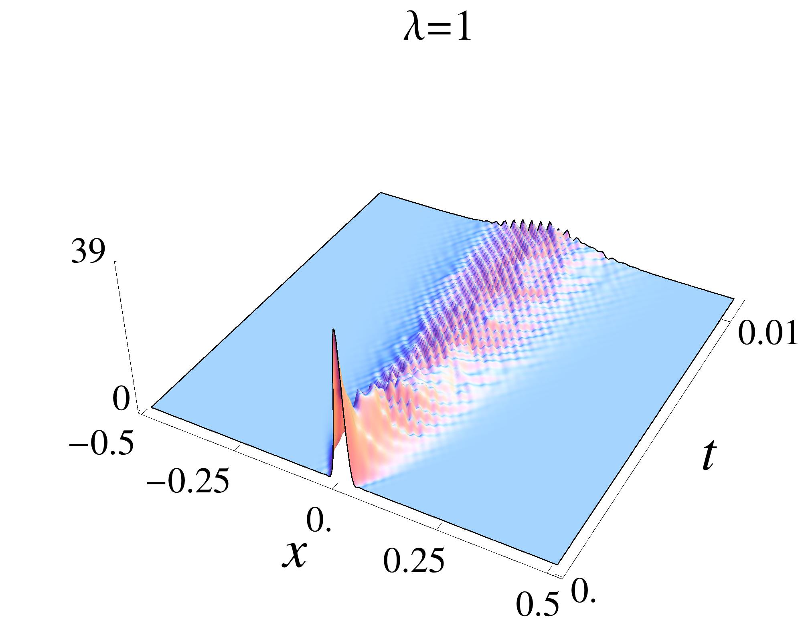
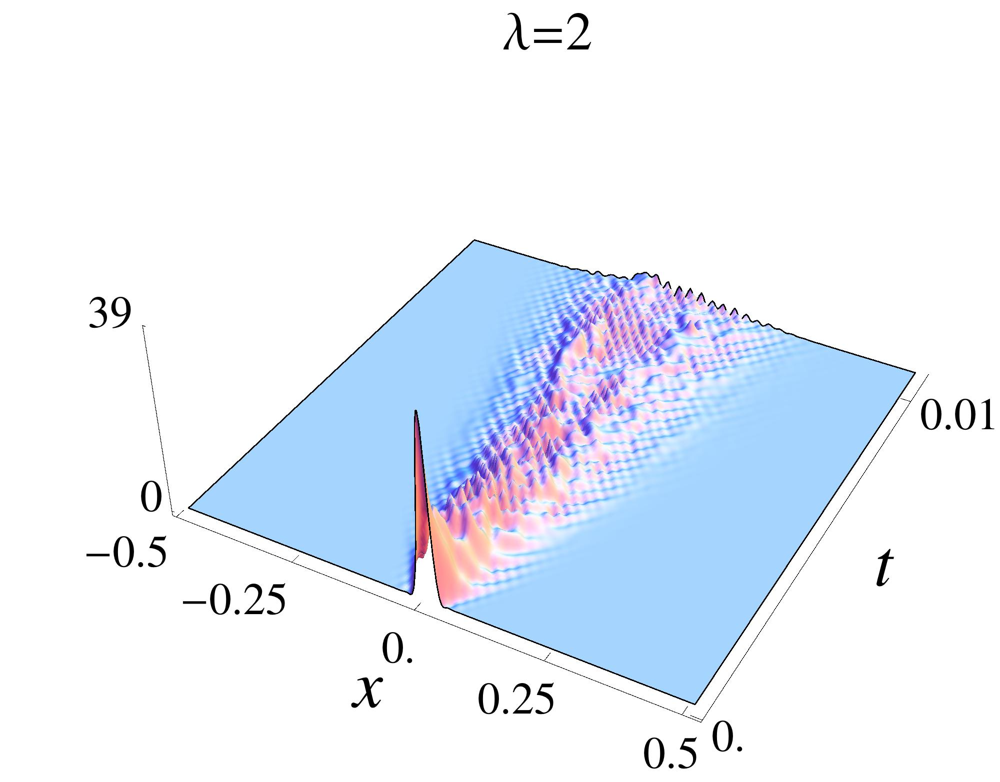
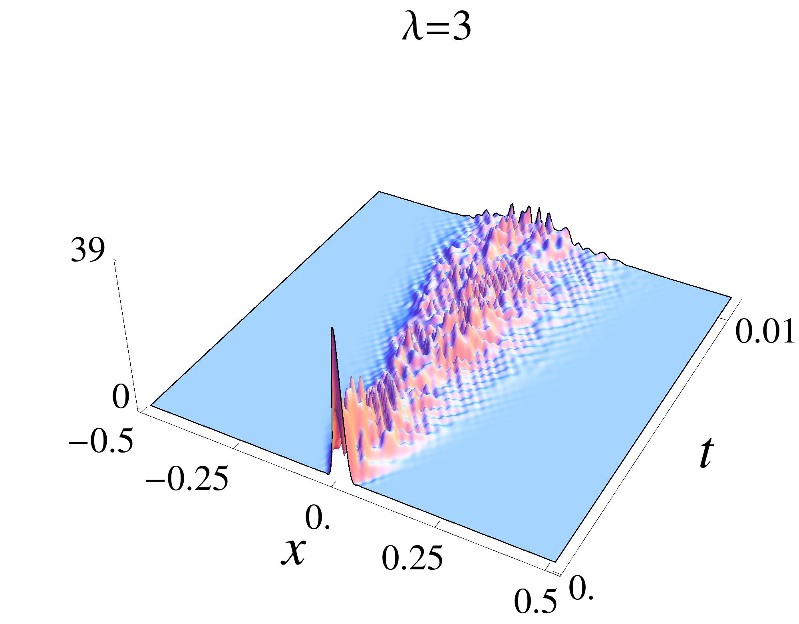
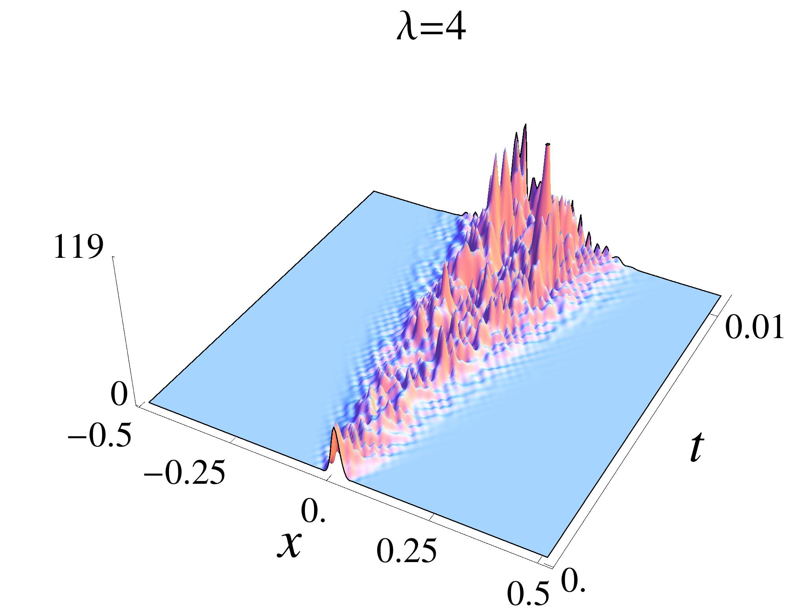
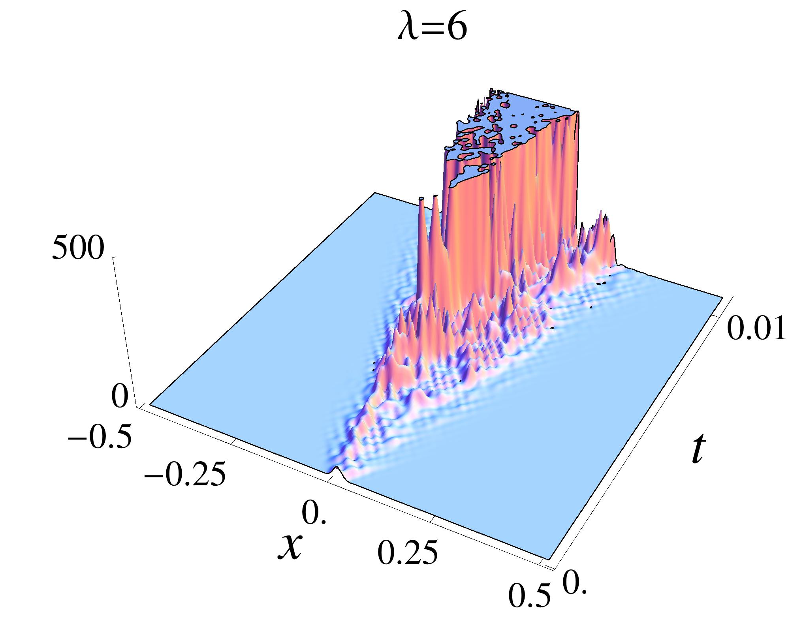
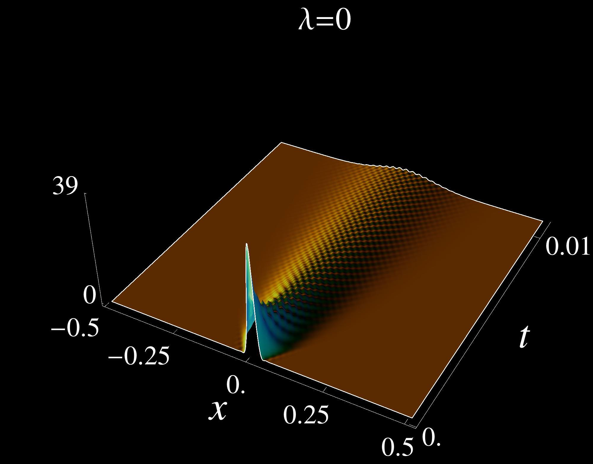
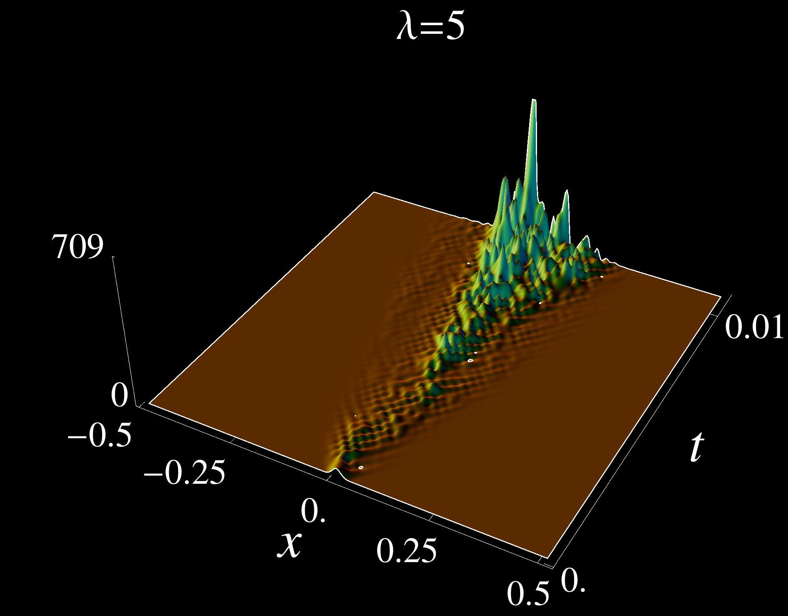

In this folder, the images are generated to illustrate the propagation of tall peaks when the stochastic heat equation started from a localized initial condition.

# Peak Propagation - Image Collection

This folder contains a collection of visualizations related to peak propagation under various conditions. The naming convention for the files is as follows:

- **Delta**: Refers to the Dirac delta initial condition.
- **L**: Refers to the parameter Lambda (\( \Lambda \)).
- **Number after L**: Represents the value of Lambda (\( \Lambda \)).
- **cut**: Indicates the plot is cut at a height of 500.
- **neg**: Indicates the plot has a dark background.

## Image Formats

The visualizations are provided in multiple formats:
- **JPEG**: Optimized for quick preview.
- **PDF**: High-resolution vector format.
- **EPS**: Suitable for LaTeX and academic publications.
- **DAT**: Raw data files for further analysis.

## File List

### JPEG Previews
Below are the JPEG previews of the images in this folder:

#### Dirac Delta Initial Condition (\( \Delta \)), Lambda (\( \Lambda \)) Values:
-  **Lambda = 0**
-  **Lambda = 1**
-  **Lambda = 2**
-  **Lambda = 3**
-  **Lambda = 4**

#### Cut Images (Height = 500):
-  **Lambda = 4 (Cut at Height 500)**
-  **Lambda = 6 (Cut at Height 500)**

#### Neg (Dark Background):
-  **Lambda = 0 (Dark Background)**
-  **Lambda = 5 (Dark Background)**

...

### Other Formats
For high-resolution or raw data, use the following files:
- **PDF**: `small_Delta_L0.pdf`, `small_Delta_L1.pdf`, etc.
- **EPS**: `small_Delta_L0.eps`, `small_Delta_L1.eps`, etc.
- **DAT**: `small_Delta_L0.dat`, `small_Delta_L1.dat`, etc.

<!-- ## Usage -->
<!-- These visualizations are designed for academic use, such as: -->
<!-- - Conference posters -->
<!-- - Research presentations -->
<!-- - Publications -->
<!---->
<!-- Feel free to explore and use the images. If you find them helpful, a mention in your work would be appreciated! -->

---
